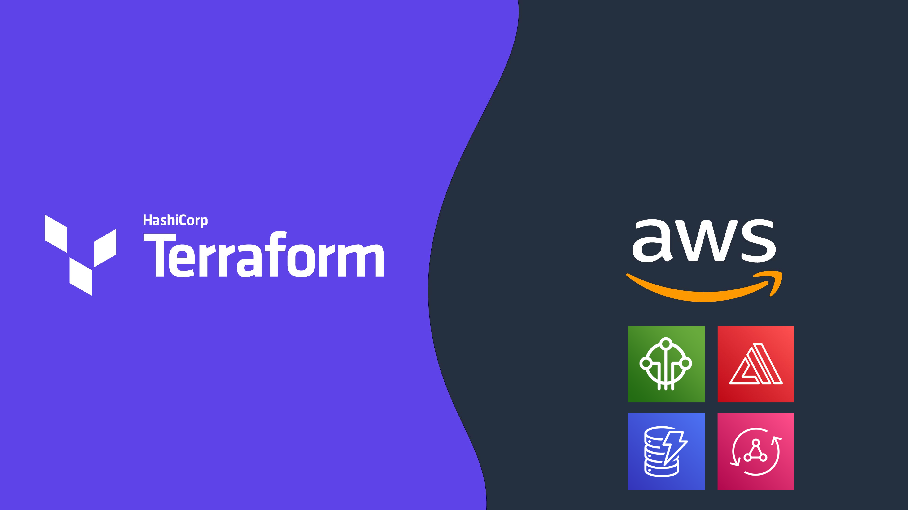

# Mini Pupper IoT: Connected Worker Safety with Robots and Terraform! 🐶🐾
#### Core Contributors:
**[Kevon Mayers](https://www.linkedin.com/in/kevonmayers)** - Project Lead, Terraform deployment & Full Stack Web App

**[Adam (Spidey) Purdie](https://www.linkedin.com/in/adampurdie/)** - Mini Pupper Development, MQTT to ROS bridge development

This workshop is a guided example of how you can leverage AWS IoT Core, AWS Amplify, Terraform, and robotics to improve worker safety. The robots used in this workshop are called Mini Pupper 2. If you're not familiar with **[Mini Pupper 2](hhttps://mangdang.store/products/mini-pupper-open-source-ros-robot-dog-kit)**, it is an open-source robotic operating system. While Mini Pupper 2 comes with support for control with a game controller, we extended upon it's core functionality and have created a web and mobile app that you can use to issue commands through AWS for added functionality. We have also added support for a companion Air Quality Sensor (M5StickCPlus) where the robots will perform actions in response to detection of simulated toxins.

We have connected Mini Pupper 2 to **[AWS IoT Core](https://aws.amazon.com/iot-core/)** and have created a serverless full stack **[AWS Amplify](https://aws.amazon.com/amplify/)** App where you can issue commands to Mini Pupper, and can also visualize the data such as messages sent/received, and charts. For the UI we are leveraging Cloudscape, an open-source UI Design Library created by Amazon Web Services (AWS).

As shown in this architecture, the Mini Pupper is able to receive MQTT messages through a MQTT to ROS bridge, that translates MQTT messages to ROS commands, and vice versa.

To provide a streamlined and repeatable deployment, we are leveraging **[Terraform](https://www.terraform.io/)** for Infrastructure as Code (IaC). If you are not too familiar with Terraform, don't worry - we have created a custom Terraform module to abstract away most of the infrastructure creation down to a few lines of code. For those more experienced with Terraform, feel free to fork this repo and customize/add on to this solution, we are making it completely open-source. Contributions are also welcome!

To see Mini Pupper 2 in action, check out **[this video](https://www.youtube.com/watch?v=LeT10vdBSJM&t=1s)**.

 For getting started quickly, check out some of our provided **[code examples](https://github.com/novekm/iot-robopupper/tree/main/terraform-deployment/examples)**.

 For detailed information and step-by-step guidance, check out the full workshop on **[AWS Workshop Studio](https://workshops.aws/).**

 <!-- TODO - Update this with public URL when it is out -->

