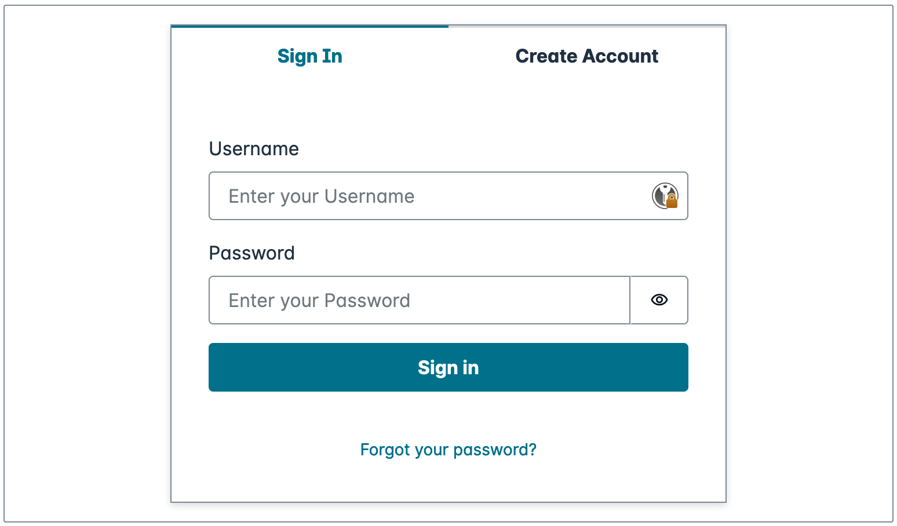
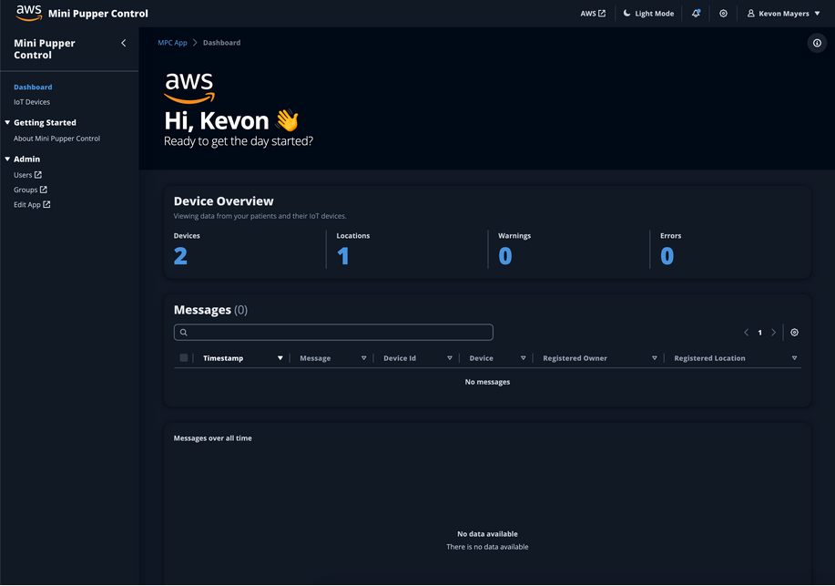

1. Change `mpc-web-app` directory

```sh
cd ../mpc-web-app
```

3. Install dependencies

```sh
yarn

# or

npm i
```

Next, let's start the local dev server by typing the command below:

```sh
yarn dev 

# or

npm run dev
```

You should now be able to sign Up or sign In.



> For username, enter either the username or the email address you defined in main.tf earlier. For password paste in the TOPT that was sent to your email address. You'll then be prompted to change your password

Upon successful authentication, you'll be brought to the dashboard as shown below:


